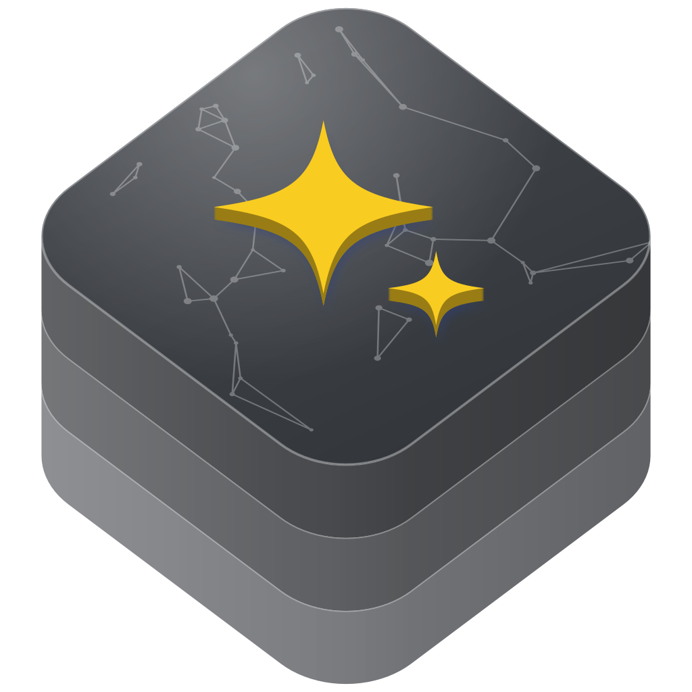

<p align="center">
  
</p>

<h1 align="center">skills</h1>

<p align="center">
  Claude and Codex skills for Swift packages, Apple frameworks, SwiftUI and UIKit, developer tooling, and release engineering.
</p>

<p align="center">
  <a href="LICENSE"></a>
</p>

[Overview](#overview) · [Install](#install) · [Skills](#skills) ·
[Usage](#usage) · [Contributing](#contributing) · [License](#license)

> [!NOTE]
> The collection has no tagged release yet. Every install method below uses
> the current `master` branch.

## Overview

A skill is a folder with a `SKILL.md` file and supporting material that Claude
or Codex loads when a request matches the skill's description. This collection
provides 101 skills for Swift and Apple-platform work: the Swift language
and Swift packages, SwiftUI and UIKit, Apple frameworks from App Intents to
RealityKit, repository documentation, and release engineering.

- Each description states what the skill covers and what it does not, so the
  agent can choose the most specific skill for a task.
- `SKILL.md` stays short. Rules, references, templates, and scripts load only
  when a task needs them.
- Skills are independent: install any subset, and no skill reads another
  skill's files.
- Authoring rules require Apple and Swift facts to be checked against current
  official documentation, SDKs, or tool output before they become rules.
- Mechanical checks ship as scripts, for example README fact checks,
  Quick start builds, publish-boundary scans, and package audits.

## Install

The plugin marketplace installs skills by name. The other methods install a
single skill directory; do not install the repository root as a skill. The
examples use `swiftpm-docs`; replace it with any name from the
[catalog](#skills).

### Claude Code plugin marketplace

The repository is a Claude Code plugin marketplace named `swift-skills`, with
one plugin per skill. Add it and install the skills you want:

```bash
claude plugin marketplace add swift-library/skills
claude plugin install swiftpm-docs@swift-skills
```

Inside Claude Code, run the same commands as `/plugin marketplace add` and
`/plugin install`.

### Claude Code skills directory

Clone the repository and copy a skill into `~/.claude/skills`:

```bash
git clone https://github.com/swift-library/skills.git
cd skills
mkdir -p ~/.claude/skills
cp -R skills/swiftpm-docs ~/.claude/skills/swiftpm-docs
```

To follow updates with `git pull`, link the directory instead of copying it:

```bash
ln -s "$(pwd)/skills/swiftpm-docs" ~/.claude/skills/swiftpm-docs
```

### Claude apps

From the root of the cloned repository, zip the skill folder:

```bash
cd skills
zip -r ../swiftpm-docs.zip swiftpm-docs
```

In Claude, open **Settings > Capabilities > Skills**, choose upload, and select
`swiftpm-docs.zip`.

### Codex

From the root of the cloned repository, copy the skill into the `skills`
directory under `CODEX_HOME`, which defaults to `~/.codex`:

```bash
mkdir -p "${CODEX_HOME:-$HOME/.codex}/skills"
cp -R skills/swiftpm-docs "${CODEX_HOME:-$HOME/.codex}/skills/swiftpm-docs"
```

Use `ln -s "$(pwd)/skills/swiftpm-docs"` with the same destination to link the
directory instead. Restart Codex after installing so that it loads the new
skill.

## Skills

### Swift language and packages

| Skill | What it covers |
| --- | --- |
| [`swift-programming-language`](skills/swift-programming-language/SKILL.md) | Broad Swift language and API baseline work. |
| [`swift-code-taste`](skills/swift-code-taste/SKILL.md) | Apply Swift code taste while writing or reviewing code. |
| [`swift-concurrency-patterns`](skills/swift-concurrency-patterns/SKILL.md) | Diagnose and modernize Swift Concurrency code. |
| [`swift-testings-patterns`](skills/swift-testings-patterns/SKILL.md) | Write and review Swift Testing tests. |
| [`swiftpm-architecture`](skills/swiftpm-architecture/SKILL.md) | Design and review Swift package architecture. |
| [`swiftpm-index`](skills/swiftpm-index/SKILL.md) | Check SwiftPM infrastructure and package collection catalogs. |
| [`swiftpm-distiller`](skills/swiftpm-distiller/SKILL.md) | Distill Swift packages into agent-ready skills. |
| [`swiftpm-plugin-patterns`](skills/swiftpm-plugin-patterns/SKILL.md) | Design and debug SwiftPM plugin tools. |
| [`swift-scripts-patterns`](skills/swift-scripts-patterns/SKILL.md) | Write Swift scripts with swift-sh safely and portably. |
| [`swift-python-patterns`](skills/swift-python-patterns/SKILL.md) | Operate Swift PythonKit-style bridge packages. |
| [`swift-design-tokens-patterns`](skills/swift-design-tokens-patterns/SKILL.md) | Operate Swift design-token compiler packages. |
| [`swiftlint-patterns`](skills/swiftlint-patterns/SKILL.md) | Implement and review SwiftLint enforcement. |

### Repository documentation and release

| Skill | What it covers |
| --- | --- |
| [`swiftpm-docs`](skills/swiftpm-docs/SKILL.md) | Scaffold and audit Swift package documentation structure. |
| [`swiftpm-readme-design`](skills/swiftpm-readme-design/SKILL.md) | Design and verify Swift package READMEs and repository pages. |
| [`swiftpm-github-release`](skills/swiftpm-github-release/SKILL.md) | Dry-run SwiftPM GitHub release readiness. |
| [`apple-platform-release`](skills/apple-platform-release/SKILL.md) | Prepare Apple-platform signing, Xcode export, notarization, and release artifacts. |
| [`swiftpm-macos-app-packaging`](skills/swiftpm-macos-app-packaging/SKILL.md) | Package SwiftPM macOS executables into signed, notarized .app bundles. |

### SwiftUI, UIKit, and interface

| Skill | What it covers |
| --- | --- |
| [`swiftui-patterns`](skills/swiftui-patterns/SKILL.md) | SwiftUI state, layout, controls, and APIs. |
| [`swiftui-design`](skills/swiftui-design/SKILL.md) | SwiftUI visuals and native control choice. |
| [`swiftui-performance`](skills/swiftui-performance/SKILL.md) | Code-first SwiftUI performance guidance before Instruments. |
| [`swiftui-architecture`](skills/swiftui-architecture/SKILL.md) | Choose and review SwiftUI feature architecture. |
| [`swiftui-tca-architecture`](skills/swiftui-tca-architecture/SKILL.md) | Design and review SwiftUI TCA features. |
| [`uikit-architecture`](skills/uikit-architecture/SKILL.md) | Choose and review UIKit module architecture. |
| [`figma-swiftui`](skills/figma-swiftui/SKILL.md) | Translate Figma designs into native SwiftUI. |
| [`interface-writing`](skills/interface-writing/SKILL.md) | UI copy, microcopy, strings, and labels. |
| [`accessibility-patterns`](skills/accessibility-patterns/SKILL.md) | Apple accessibility implementation, audit, and Nutrition Label patterns. |
| [`focus-engine-patterns`](skills/focus-engine-patterns/SKILL.md) | Fix Apple platform focus behavior. |
| [`swift-charts-patterns`](skills/swift-charts-patterns/SKILL.md) | Swift Charts marks, axes, selection, and accessibility patterns. |
| [`tipkit-patterns`](skills/tipkit-patterns/SKILL.md) | Implement and review TipKit feature-discovery flows. |
| [`widgetkit-patterns`](skills/widgetkit-patterns/SKILL.md) | Implement and review WidgetKit extensions. |
| [`widgetkit-design`](skills/widgetkit-design/SKILL.md) | Review and polish native WidgetKit visuals. |
| [`xcode-localization-patterns`](skills/xcode-localization-patterns/SKILL.md) | Implement and review Xcode and Swift localization workflows. |

### Data, storage, and sync

| Skill | What it covers |
| --- | --- |
| [`swiftdata-patterns`](skills/swiftdata-patterns/SKILL.md) | SwiftData schema, context, migration, sync, and query patterns. |
| [`swift-data-writable-patterns`](skills/swift-data-writable-patterns/SKILL.md) | Writable SwiftData query, model, relationship, and transaction surfaces. |
| [`core-data-patterns`](skills/core-data-patterns/SKILL.md) | Core Data stack, model, migration, sync, and performance patterns. |
| [`cloudkit-patterns`](skills/cloudkit-patterns/SKILL.md) | Implement and review CloudKit data workflows. |

### Security, identity, and privacy

| Skill | What it covers |
| --- | --- |
| [`keychain-patterns`](skills/keychain-patterns/SKILL.md) | Apple Keychain storage, access control, sharing, and credential migration patterns. |
| [`cryptokit-patterns`](skills/cryptokit-patterns/SKILL.md) | CryptoKit encryption, hashing, signing, HPKE, Secure Enclave, and crypto testing patterns. |
| [`certificate-trust-patterns`](skills/certificate-trust-patterns/SKILL.md) | SecTrust, certificate pinning, SPKI pins, client certificates, and mTLS patterns. |
| [`authenticationservices-patterns`](skills/authenticationservices-patterns/SKILL.md) | Implement and review Apple authentication flows. |
| [`devicecheck-patterns`](skills/devicecheck-patterns/SKILL.md) | Implement and review DeviceCheck and App Attest flows. |
| [`cryptotokenkit-patterns`](skills/cryptotokenkit-patterns/SKILL.md) | Implement and review CryptoTokenKit token and smart card flows. |
| [`permissionkit-patterns`](skills/permissionkit-patterns/SKILL.md) | Implement and review PermissionKit communication. |
| [`macos-tcc-permissions-patterns`](skills/macos-tcc-permissions-patterns/SKILL.md) | macOS privacy permission flows, System Settings guidance, and helper identity checks. |

### App services and system integration

| Skill | What it covers |
| --- | --- |
| [`app-intents-patterns`](skills/app-intents-patterns/SKILL.md) | Implement and review App Intents system integrations. |
| [`activitykit-patterns`](skills/activitykit-patterns/SKILL.md) | Implement and review Live Activities with ActivityKit. |
| [`app-clips-patterns`](skills/app-clips-patterns/SKILL.md) | Implement and review App Clip targets and invocation flows. |
| [`user-notifications-patterns`](skills/user-notifications-patterns/SKILL.md) | Implement and review UserNotifications and APNs flows. |
| [`background-tasks-patterns`](skills/background-tasks-patterns/SKILL.md) | Implement and review BackgroundTasks scheduling. |
| [`relevancekit-patterns`](skills/relevancekit-patterns/SKILL.md) | Implement and review RelevanceKit widget relevance. |
| [`alarmkit-patterns`](skills/alarmkit-patterns/SKILL.md) | Implement and review AlarmKit alarms and timers. |
| [`callkit-patterns`](skills/callkit-patterns/SKILL.md) | Implement and review CallKit and PushKit VoIP flows. |
| [`group-activities-patterns`](skills/group-activities-patterns/SKILL.md) | Implement and review GroupActivities and SharePlay. |
| [`carplay-patterns`](skills/carplay-patterns/SKILL.md) | Implement and review CarPlay template surfaces. |
| [`appmigrationkit-patterns`](skills/appmigrationkit-patterns/SKILL.md) | Implement and review AppMigrationKit transfers. |
| [`energykit-patterns`](skills/energykit-patterns/SKILL.md) | Implement and review EnergyKit guidance. |
| [`browserenginekit-patterns`](skills/browserenginekit-patterns/SKILL.md) | Implement and review BrowserEngineKit engines. |

### Commerce, wallet, and attribution

| Skill | What it covers |
| --- | --- |
| [`storekit-patterns`](skills/storekit-patterns/SKILL.md) | Implement and review StoreKit purchases and entitlements. |
| [`passkit-patterns`](skills/passkit-patterns/SKILL.md) | Implement and review Apple Pay and Wallet flows. |
| [`financekit-patterns`](skills/financekit-patterns/SKILL.md) | Implement and review FinanceKit financial-data flows. |
| [`adattributionkit-patterns`](skills/adattributionkit-patterns/SKILL.md) | Implement and review AdAttributionKit APIs. |

### Personal data and location

| Skill | What it covers |
| --- | --- |
| [`contacts-patterns`](skills/contacts-patterns/SKILL.md) | Implement and review Contacts and ContactsUI workflows. |
| [`eventkit-patterns`](skills/eventkit-patterns/SKILL.md) | Implement and review EventKit calendar and reminder flows. |
| [`healthkit-patterns`](skills/healthkit-patterns/SKILL.md) | Implement and review HealthKit data and workout flows. |
| [`mapkit-patterns`](skills/mapkit-patterns/SKILL.md) | Implement and review MapKit and map-backed location flows. |
| [`weatherkit-patterns`](skills/weatherkit-patterns/SKILL.md) | Implement and review WeatherKit data and attribution flows. |

### Media, graphics, and games

| Skill | What it covers |
| --- | --- |
| [`photokit-patterns`](skills/photokit-patterns/SKILL.md) | Implement and review Photos, PhotosUI, and camera workflows. |
| [`avkit-patterns`](skills/avkit-patterns/SKILL.md) | Implement and review AVKit playback surfaces. |
| [`musickit-patterns`](skills/musickit-patterns/SKILL.md) | Implement and review Apple Music and MusicKit features. |
| [`pdfkit-patterns`](skills/pdfkit-patterns/SKILL.md) | Implement and review PDFKit document workflows. |
| [`paperkit-patterns`](skills/paperkit-patterns/SKILL.md) | Implement and review PaperKit structured markup workflows. |
| [`pencilkit-patterns`](skills/pencilkit-patterns/SKILL.md) | Implement and review PencilKit drawing workflows. |
| [`core-haptics-patterns`](skills/core-haptics-patterns/SKILL.md) | Implement and review Core Haptics engines, AHAP patterns, and haptic validation. |
| [`gamekit-patterns`](skills/gamekit-patterns/SKILL.md) | Implement and review GameKit and Game Center. |
| [`spritekit-patterns`](skills/spritekit-patterns/SKILL.md) | Implement and review SpriteKit 2D scenes. |
| [`scenekit-patterns`](skills/scenekit-patterns/SKILL.md) | Implement and review SceneKit 3D scenes. |
| [`tabletopkit-patterns`](skills/tabletopkit-patterns/SKILL.md) | Implement and review TabletopKit games. |
| [`realitykit-patterns`](skills/realitykit-patterns/SKILL.md) | Implement and review RealityKit and ARKit. |

### Machine learning and language

| Skill | What it covers |
| --- | --- |
| [`foundation-models-patterns`](skills/foundation-models-patterns/SKILL.md) | Implement and review Apple Foundation Models generation flows. |
| [`core-ml-patterns`](skills/core-ml-patterns/SKILL.md) | Implement and review Core ML conversion, inference, and deployment. |
| [`mlx-swift-patterns`](skills/mlx-swift-patterns/SKILL.md) | Implement and review MLX Swift package runtime work. |
| [`vision-patterns`](skills/vision-patterns/SKILL.md) | Implement and review Vision and VisionKit recognition flows. |
| [`natural-language-patterns`](skills/natural-language-patterns/SKILL.md) | Implement and review Natural Language and Translation flows. |
| [`speech-patterns`](skills/speech-patterns/SKILL.md) | Implement and review Speech framework transcription flows. |

### Networking and the web

| Skill | What it covers |
| --- | --- |
| [`foundation-urlsession-patterns`](skills/foundation-urlsession-patterns/SKILL.md) | Implement and review Foundation URLSession networking. |
| [`network-framework-patterns`](skills/network-framework-patterns/SKILL.md) | Implement and review Network.framework transports. |
| [`webkit-patterns`](skills/webkit-patterns/SKILL.md) | Implement and review embedded WebKit surfaces. |
| [`swiftwasm-patterns`](skills/swiftwasm-patterns/SKILL.md) | Build and port Swift with Wasm SDKs. |
| [`javascriptkit-patterns`](skills/javascriptkit-patterns/SKILL.md) | Use JavaScriptKit for Swift Wasm interop. |
| [`bridge-js-patterns`](skills/bridge-js-patterns/SKILL.md) | Typed Swift-JavaScript bridge codegen. |

### Devices, sensors, and accessories

| Skill | What it covers |
| --- | --- |
| [`accessorysetupkit-patterns`](skills/accessorysetupkit-patterns/SKILL.md) | Implement and review AccessorySetupKit setup flows. |
| [`core-bluetooth-patterns`](skills/core-bluetooth-patterns/SKILL.md) | Implement and review Core Bluetooth BLE flows. |
| [`core-nfc-patterns`](skills/core-nfc-patterns/SKILL.md) | Implement and review Core NFC tag workflows. |
| [`core-motion-patterns`](skills/core-motion-patterns/SKILL.md) | Implement and review Core Motion sensor flows. |
| [`dockkit-patterns`](skills/dockkit-patterns/SKILL.md) | Implement and review DockKit accessory tracking. |
| [`sensorkit-patterns`](skills/sensorkit-patterns/SKILL.md) | Implement and review SensorKit research data access. |
| [`audioaccessorykit-patterns`](skills/audioaccessorykit-patterns/SKILL.md) | Implement and review AudioAccessoryKit accessory state. |
| [`homekit-patterns`](skills/homekit-patterns/SKILL.md) | Implement and review HomeKit and MatterSupport flows. |

### Diagnostics and simulators

| Skill | What it covers |
| --- | --- |
| [`xcode-instruments`](skills/xcode-instruments/SKILL.md) | Record and analyze Xcode Instruments traces. |
| [`metrickit-patterns`](skills/metrickit-patterns/SKILL.md) | Implement and review MetricKit telemetry. |
| [`ios-simulator`](skills/ios-simulator/SKILL.md) | Script-backed iOS Simulator automation, diagnostics, and UI-driving tools. |

## Usage

Claude and Codex select a skill automatically when a request matches its
description. Name the skill to select it explicitly:

- "Audit this repository's documentation with swiftpm-docs."
- "Use swift-concurrency-patterns to fix these Sendable diagnostics."
- "Check this package's README and Quick start with swiftpm-readme-design."
- "Run the swiftpm-github-release checks before I make this repository public."

When two skills could apply, the more specific one should win: a SwiftUI
rendering question belongs to `swiftui-performance` rather than
`swiftui-patterns`, and a framework review belongs to that framework's skill
rather than `swift-programming-language`. [AGENTS.md](AGENTS.md) records the
routing for pairs that overlap.

Skills with scripts need the tools those scripts call, such as `git`, `swift`,
`xcodebuild`, or Python 3. The skill's `SKILL.md` or `scripts/README.md` names
them.

## Contributing

Read [CONTRIBUTING.md](CONTRIBUTING.md) before opening a pull request. Each
skill lives in `skills/<skill>/`:

- `SKILL.md`: the trigger description, scope, workflow, validation rules, and
  output format
- `agents/openai.yaml`: display name, short description, and default prompt
  for Codex
- optional `rules/`, `references/`, `knowledge/`, `profiles/`, `templates/`,
  `examples/`, `scripts/`, `cli/`, and `assets/`, each with an index when it
  holds more than one file

[Skill authoring](Documentation/Architecture/skill-authoring.md) defines the
structure, trigger contract, and validation checklist for new or changed
skills. `.claude-plugin/marketplace.json` lists the skills that the Claude Code
marketplace publishes. To test changes, validate the catalog and add your
clone as a local marketplace:

```bash
claude plugin validate .
claude plugin marketplace add ./
```

Commit subjects follow Conventional Commits, and a pull request check enforces
them. [SUPPORT.md](SUPPORT.md) covers questions and bug reports, and
[GOVERNANCE.md](GOVERNANCE.md) describes how decisions are made. Report
vulnerabilities through the private route in [SECURITY.md](SECURITY.md).
Participation follows the [Code of Conduct](CODE_OF_CONDUCT.md).

## License

The skills are licensed under the Apache License 2.0 with the Swift Runtime
Library Exception, so code copied from a skill into an app needs no
attribution. See [LICENSE](LICENSE) and [NOTICE](NOTICE). Material from other
authors keeps its own license, noted in the skill that includes it.
